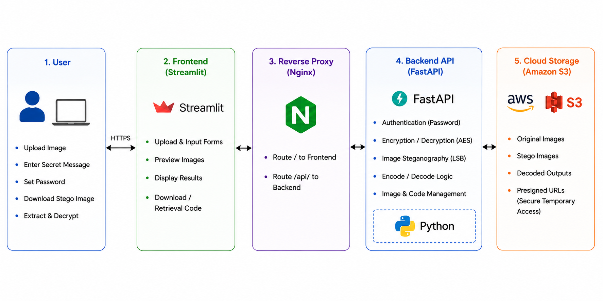
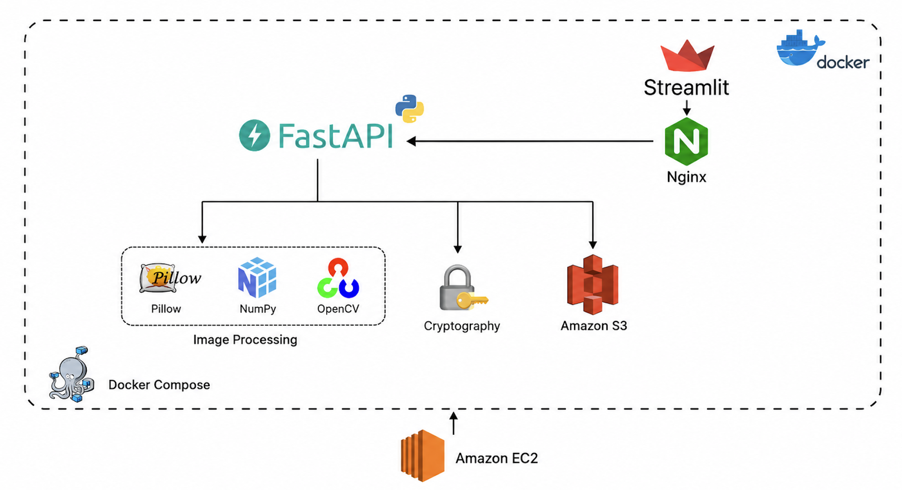

# Encrypted Image Steganography Web Service | MODERN CLOUD SERVICE | AWS S3/EC2 | Docker 

<p align="center">
  
</p>

## Introduction

This project is a web application for hiding encrypted text messages inside images.

A user uploads an image, writes a message, chooses a password and selects one of three steganography methods: **LSB**, **DCT**, or **DWT**. The application encrypts the message before embedding it into the image. The receiver can later upload the generated image and use the same password and method to recover the message.

The project was developed as part of my master's thesis, **Encrypted Image Steganography Web Service — Design & Evaluation**.

The main goals were to:

- build a complete web application instead of testing the algorithms only in notebooks;
- combine encryption and image steganography;
- compare LSB, DCT, and DWT using image-quality measurements;
- store and retrieve generated images through Amazon S3; and
- provide a basic detector for analyzing suspicious images.

For someone without a technical background, the idea is similar to placing a locked note inside a photograph. The image hides the note, while the password protects its content.

## Architecture
<p align="center">
  
</p>

The application is divided into two main services:

- **Streamlit frontend** — provides the pages for encoding, decoding, and image analysis.
- **FastAPI backend** — handles encryption, steganography, image evaluation, detection, and S3 communication.

Both services run in separate Docker containers. Nginx can be used as a reverse proxy when the application is deployed on an AWS EC2 instance.

## Demo

<p align="center">
  
</p>


## How It Works

### Encoding

1. The user uploads a cover image.
2. The user enters a text message and password.
3. The message is encrypted using AES-GCM.
4. The encrypted data is embedded into the image using LSB, DCT, or DWT.
5. The application returns the stego image and its quality measurements.
6. When Amazon S3 is enabled, the image can also be retrieved later using a temporary code.

### Decoding

1. The receiver uploads the stego image or enters its retrieval code.
2. The receiver selects the method used during encoding.
3. The hidden data is extracted from the image.
4. The correct password decrypts the original message.

### Detection

The detector examines statistical patterns in an uploaded image and returns a risk score.

The result is only an indication. It does not prove that an image contains a hidden message. The current implementation uses heuristic analysis, while a CNN-based detector is planned as future work.

## Technology Used

<p align="center">
  
</p>


### Programming Language

- [Python](https://www.python.org/)

### Frontend

- [Streamlit](https://streamlit.io/)
- [Pillow](https://python-pillow.org/)

### Backend

- [FastAPI](https://fastapi.tiangolo.com/)
- [Uvicorn](https://www.uvicorn.org/)
- [Pydantic](https://docs.pydantic.dev/)

### Image Processing and Evaluation

- [NumPy](https://numpy.org/)
- [scikit-image](https://scikit-image.org/)
- [PyWavelets](https://pywavelets.readthedocs.io/)

### Encryption

- AES-GCM
- PBKDF2
- [PyCryptodome](https://www.pycryptodome.org/)

### Cloud and Deployment

- [Amazon EC2](https://aws.amazon.com/ec2/)
- [Amazon S3](https://aws.amazon.com/s3/)
- [Docker](https://www.docker.com/)
- [Docker Compose](https://docs.docker.com/compose/)
- [Nginx](https://nginx.org/)

### Testing

- [Pytest](https://docs.pytest.org/)

## Image Evaluation

The project compares the original image with the generated stego image using the following measurements:

| Metric | Purpose |
|---|---|
| **PSNR** | Measures the amount of distortion introduced by embedding |
| **SSIM** | Measures the structural similarity between two images |
| **BPP** | Measures how many hidden bits are stored per pixel |
| **Embedding time** | Measures how long the selected method takes |

In general, a higher PSNR and an SSIM value closer to `1` mean that the stego image is more similar to the original image.

## Project Structure

```text
Steganography/
├── backend/
│   └── app/
│       ├── api/              # FastAPI routes
│       ├── schemas/          # Request and response models
│       ├── services/         # Encryption, steganography and detector services
│       ├── utils/            # S3 and image utilities
│       └── main.py           # FastAPI entry point
│
├── shared/
│   ├── crypto/               # AES-GCM encryption and decryption
│   ├── evaluation/           # PSNR, SSIM, BPP and timing
│   ├── stego/                # LSB, DCT and DWT implementations
│   └── utils/                # Shared helper functions
│
├── streamlit_app/
│   ├── assets/images/
│   ├── pages/
│   │   ├── 1_Encoder.py
│   │   ├── 2_Decoder.py
│   │   └── 3_Detector.py
│   ├── api_client.py
│   └── main.py
│
├── tests/
├── Dockerfile.fastapi
├── Dockerfile.streamlit
├── docker-compose.yml
└── requirements.txt
```

## Run the Project

### Requirements

Install the following tools:

- [Git](https://git-scm.com/)
- [Docker Desktop](https://www.docker.com/products/docker-desktop/)

### Clone the Repository

```bash
git clone https://github.com/larrydinh/Steganography.git
cd Steganography
```

### Start with Docker

```bash
docker compose up --build
```

Open:

- Streamlit application: [http://localhost:8501](http://localhost:8501)
- FastAPI documentation: [http://localhost:8000/docs](http://localhost:8000/docs)
- Backend health check: [http://localhost:8000/health](http://localhost:8000/health)

Stop the services with:

```bash
docker compose down
```

## Amazon S3 Configuration

Amazon S3 is optional. The application can still encode, download, upload, and decode images without it.

S3 is required for retrieval codes and temporary cloud storage.

Create a `.env` file in the project root:

```env
AWS_REGION=eu-central-1
S3_BUCKET_NAME=your-bucket-name

S3_SOURCE_PREFIX=source/
S3_ENCODED_PREFIX=encoded/
S3_DECODED_PREFIX=decoded/
S3_RETRIEVAL_PREFIX=retrieval/

PRESIGNED_URL_EXPIRES=3600
RETRIEVAL_CODE_TTL_HOURS=24

AWS_ACCESS_KEY_ID=your-access-key
AWS_SECRET_ACCESS_KEY=your-secret-key
```

Do not upload the `.env` file or AWS credentials to GitHub. For EC2 deployment, an IAM role is safer than storing permanent access keys on the server.

## API Endpoints

| Method | Endpoint | Description |
|---|---|---|
| `GET` | `/health` | Checks whether the backend is running |
| `POST` | `/encode` | Encrypts and embeds a message |
| `POST` | `/decode` | Extracts and decrypts a message |
| `POST` | `/retrieve` | Retrieves an image using a temporary code |
| `POST` | `/detect/analyze` | Analyzes an image for suspicious patterns |

The complete interactive API documentation is available at:

```text
http://localhost:8000/docs
```

Depending on the reverse-proxy configuration, production endpoints may use an `/api` prefix.

## Run the Tests

```bash
pytest -q
```

## Demo

A typical demonstration follows this flow:

1. Upload a PNG image on the Encoder page.
2. Enter a message and password.
3. Select LSB, DCT, or DWT.
4. Generate and download the stego image.
5. Open the Decoder page.
6. Upload the generated image.
7. Enter the same password and method.
8. Recover the original message.
9. Compare the original and stego images using PSNR, SSIM, BPP, and processing time.

A public demo link or thesis demonstration video can be added here when available.

## Challenges

- The main challenge was keeping the stego image visually similar to the original after embedding encrypted data. The application also needed to handle images with different formats, dimensions, and storage requirements while ensuring that the same file could move reliably through the complete workflow of encoding, cloud storage, retrieval, and decoding.
- Another important challenge was protecting the message before embedding it, which required combining encryption with the steganography methods. From a software engineering perspective, the frontend and backend had to be separated into independent services and packaged for deployment. Deploying the complete system with Docker, Nginx, Amazon EC2, and Amazon S3 also required careful configuration of networking, permissions, storage, and environment variables.

## Limitations

- The current system has several limitations. Editing, resizing, compressing, or converting a stego image may modify the image data and destroy the hidden message. The receiver must also know both the password and the steganography method used during encoding. The amount of text that can be embedded depends on the image dimensions, the selected method, and the size of the encrypted payload. Retrieval codes are only available when Amazon S3 is correctly configured.
- In addition, the detector provides only a statistical risk score and cannot prove with certainty that an image contains hidden information. The current implementation is limited to hiding text messages inside images.

## Future Work

- Future development could include a trained CNN-based steganography detector to improve the accuracy of suspicious-image analysis. The embedding methods could also be made more robust against image compression, resizing, and format conversion.
- For production deployment, the application should include HTTPS, stronger access controls, improved secret management, and additional security monitoring.
- A CI/CD pipeline could automate testing and deployment whenever changes are added to the repository. Further experiments could evaluate the methods on larger and more varied image datasets.

## Conclusion

This project demonstrates the complete process of encrypting a message, hiding it inside an image, storing the result, retrieving it, and recovering the original text through a web interface.

The final system combines image processing, cryptography, API development, cloud storage, containerization, and deployment in one project. It also makes it possible to compare three steganography methods using measurable results instead of visual inspection alone.

## Links

- GitHub repository: [github.com/larrydinh/Steganography](https://github.com/larrydinh/Steganography)
- LinkedIn: [linkedin.com/in/huuphucdinh](https://www.linkedin.com/in/huuphucdinh/)
- Local application: [localhost:8501](http://localhost:8501)
- Local API documentation: [localhost:8000/docs](http://localhost:8000/docs)

## Author

**Phuc Dinh**

Master's Graduate in Computer Science — High Integrity Systems  
Frankfurt University of Applied Sciences
